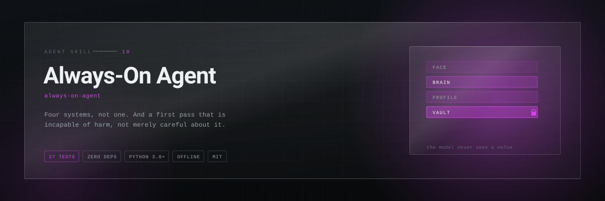
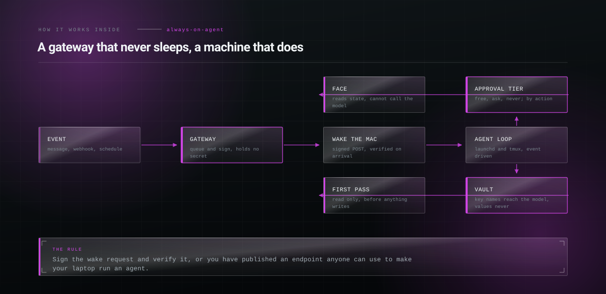

<p align="center">
  <picture>
    <source media="(prefers-color-scheme: dark)" srcset="assets/hero-dark.svg">
    <source media="(prefers-color-scheme: light)" srcset="assets/hero-light.svg">
    
  </picture>
</p>

<h1 align="center">Always-On Agent</h1>

<p align="center"><b>Build a personal AI agent that runs continuously on your own machine: the four layers to keep separate, waking a laptop that sleeps, approval gates, and a read-only first pass that maps projects and credentials without ever reading a secret's value.</b></p>

<p align="center">
<a href="LICENSE"></a>
  
  
  
  
</p>

<p align="center">
  <code>npx skills add Hiberius/always-on-agent</code>
</p>

<p align="center">
  <sub>Works with Claude Code, Claude Desktop, Codex, Cursor, Windsurf, OpenClaw and
  anything else that reads a <code>SKILL.md</code>.</sub>
</p>

---


## Phase zero: look before you touch

The first thing an agent does on your machine must be *incapable* of doing harm. Not
careful. Incapable.

```bash
python3 scripts/survey.py secrets ~/
```
```
Key NAMES only. No value in this output was ever read into memory.

/Users/you/work/api/.env  (7 keys, 4 sensitive)   <- TRACKED BY GIT
    STRIPE_SECRET_KEY, DB_PASSWORD, JWT_SECRET, WEBHOOK_SIGNING_KEY
/Users/you/side/bot/.env  (3 keys, 2 sensitive)
    TELEGRAM_TOKEN, OPENAI_API_KEY

2 secret file(s) found.
1 of them are NOT gitignored inside a repository. Fix that before anything else.
```

It reads the name on the left of the assignment and discards everything else before
returning anything. The test suite plants a canary value in every fixture and asserts it
never appears in any output. That is the contract, not a promise.

## What it does

| Command | What you get |
|---|---|
| `projects` | Every git repository, its branch, uncommitted files, unpushed commits and how long since the last one |
| `secrets` | Which files hold credentials and what the keys are called. Never a value. Exits non-zero on a credentials file tracked by git |
| `stale` | Projects untouched for a month with uncommitted work, which is how things get lost on a laptop |


## How it works inside

<p align="center">
  <picture>
    <source media="(prefers-color-scheme: dark)" srcset="assets/diagram-dark.svg">
    <source media="(prefers-color-scheme: light)" srcset="assets/diagram-light.svg">
    
  </picture>
</p>


## The status board

```bash
python3 scripts/survey.py projects ~/
```
```
PROJECT                      BRANCH            DIRTY  AHEAD   DAYS  LAST COMMIT
old-client-site              main                 34      0    412  wip before holiday
scraper                      feat/retry            6      3     41  handle 429
api                          main                  0      0      2  bump deps

27 repo(s): 4 need attention, 9 have uncommitted or unpushed work
```

## The four layers

```
FACE     what you look at            reads state, never talks to the model
BRAIN    the agent loop              event-driven, does the work
PROFILE  who you are, what you do    private, gitignored, replaceable
VAULT    secrets                     the model never sees a value
```

**The engine is publishable, the profile is not.** Two directories, one gitignored, no
client name ever inside the engine. That split is what lets you open-source the useful
half, and retrofitting it means auditing every file you have written.

## The wake problem

Your laptop sleeps, so the agent misses everything. A laptop that never sleeps has no
battery.

```
event ──► always-on gateway ──► queue ──► signed POST to the Mac ──► the Mac drains it
```

The gateway holds no secrets and does no work. Sign the wake request and verify it, or you
have published an endpoint anyone can use to make your machine run an agent.

On macOS use `launchd`, not cron: launchd runs a job missed during sleep.

## The phone channel, one rule

**Official channels only.** An unofficial client for a messaging platform gets the number
banned, and on a working phone that is the number your clients use. Not an inconvenience,
your business line.

## Four states, and the fourth is the point

**working** · **waiting for you** · **idle** · **drifting**

An agent forty minutes into something nobody asked for is the failure that actually
happens, and it is invisible unless you have named it.


## Documentation

- [`SKILL.md`](SKILL.md) — the skill itself, what the agent reads
- [`references/architecture.md`](references/architecture.md) — the four layers, wake architecture, launchd against cron, channel options, approval tiers, cost
- [`references/first-run.md`](references/first-run.md) — the read-only first pass, its five rules, what to fix first, what to build after


## Related skills

- **[invisible-text-forensics](https://github.com/Hiberius/invisible-text-forensics)** — an agent reads text other people wrote
- **[whatsapp-receptionist-builder](https://github.com/Hiberius/whatsapp-receptionist-builder)** — the same queue and idempotency thinking, hosted
- **[bank-statement-to-table](https://github.com/Hiberius/bank-statement-to-table)** — processing private documents without sending them anywhere

All ten in one install:

```
/plugin marketplace add Hiberius/hiberius-skills
```


## Work with me

I build the systems these skills came out of: performance marketing infrastructure,
lead pipelines, ad account tooling, internal automation, and products on the Cloudflare
edge stack. If you need something like this built properly, I take on freelance and
contract work.

**[Christian Calabro — github.com/Hiberius](https://github.com/Hiberius)**

Performance marketing · media buying · TypeScript · Cloudflare Workers · Next.js · Python

---

## Contributing

Issues and pull requests welcome. The rule for a change to the skill itself: it has to
be something you learned by getting it wrong once, not something you read in the docs.

## License

MIT. No network calls, no telemetry, no dependencies.
